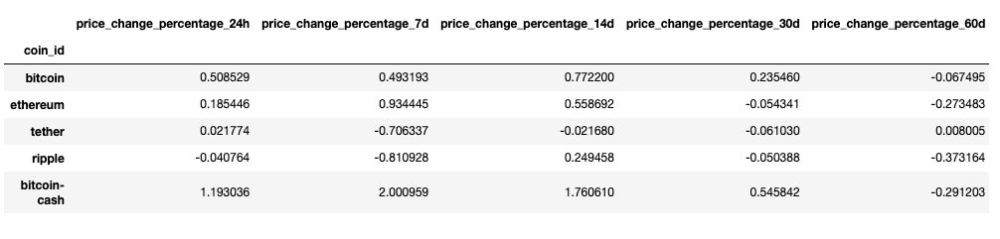
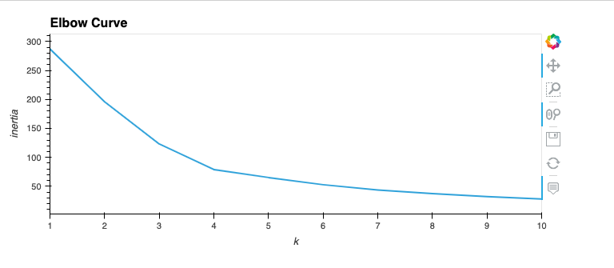
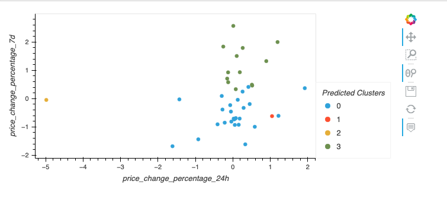
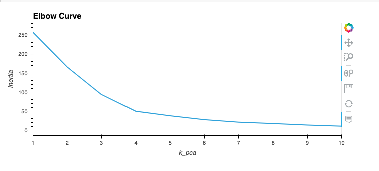
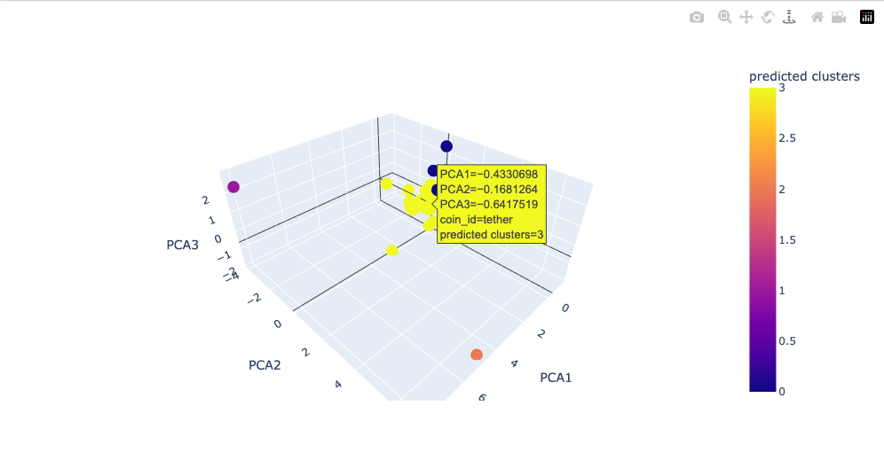
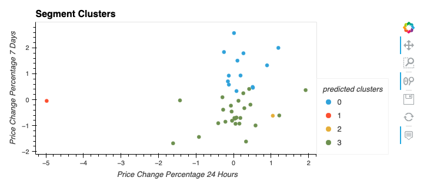

# Crypto Clustering

## Background

In this challenge, you’ll use your knowledge of Python and unsupervised learning to predict if cryptocurrencies are affected by 24-hour or 7-day price changes.

## Proccess

1. Prepare the Data

2. Find the Best Value for k Using the Original Scaled DataFrame

3. Cluster Cryptocurrencies with K-means Using the Original Scaled Data

4. Optimize Clusters with Principal Component Analysis

5. Find the Best Value for k Using the PCA Data

6. Cluster Cryptocurrencies with K-means Using the PCA Data

## Conclusion

* Answer the following question:
What is the impact of using fewer features to cluster the data using K-Means?

## References

* [Statology](https://www.statology.org/no-module-named-plotly/)

* [Holoviz](https://holoviz.org/tutorial/Composing_Plots.html)

* [The Why, When and How of 3D PCA](https://bioturing.medium.com/the-why-when-and-how-of-3d-pca-bdb5c209f)